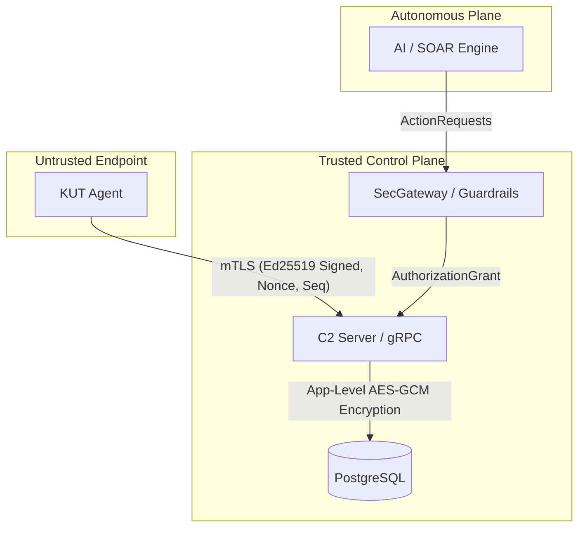

# KUT Security Fabric - Comprehensive Threat Model & Architecture Review

## 1. Trust Boundaries & Encryption Boundaries

The system defines strict trust boundaries, heavily emphasizing that the endpoint (agent) is untrusted and the control plane (C2) is the ultimate source of truth.

### 1.1 Boundary Definitions
1.  **Agent (Endpoint) -> C2 Server:** The agent operates in a hostile environment. The C2 server **must not** trust the agent's self-reported identity. Identity is exclusively derived from the mTLS client certificate CN. Local clock data is untrusted; the server provides `server_time` for policy evaluation.
2.  **C2 Server -> Database:** The database is assumed to be vulnerable to offline dumps or SQL injection. Data at rest relies on DB-level TDE, but highly sensitive fields (MACs, Hostnames) are encrypted at the application layer using AES-256-GCM.
3.  **Admin API -> C2 Server:** Admins authenticate via session tokens (`SessionSigner`). Access is controlled via strict RBAC.
4.  **AI/SOAR -> C2 Server (Agentic Plane):** Non-human principals are treated as autonomous. Their behavior is modeled via `TrustLevel` (Tainted, Untrusted, Trusted) and strict capability intersections.

---

## 2. STRIDE Analysis (Detailed Narrative)

### 2.1 Spoofing
*   **Agent Identity:** An attacker attempting to spoof an agent must possess the agent's private key. The C2 relies on mTLS and explicit client certificate validation (`ca.go`). Enrollment tokens are single-use, preventing rogue device registration.
*   **AI Identity:** AI agents must cryptographically prove their identity via `AgentPrincipal`. The system enforces that identity cannot be inferred from LLM output.

### 2.2 Tampering
*   **Telemetry & Commands:** Telemetry is signed using Ed25519 (`signingBytes`) and includes sequence numbers and nonces. A MITM attacker modifying telemetry will invalidate the signature.
*   **Evidence Chain of Custody:** The `evidence.go` package implements a hash-chained, append-only log. Modifying a previous custody record invalidates the `PrevHash` of the subsequent record.
*   **OTA Updates:** The update manifest includes an Ed25519 signature. An attacker cannot serve a backdoored agent binary even if they compromise the download URL, as the signature will fail validation.

### 2.3 Repudiation
*   **Admin Actions:** All destructive actions (WIPE, LOCK) are logged into a tamper-evident audit log (`audit_log`). The hash chain ensures that an admin cannot delete their tracks without breaking the entire chain.
*   **Approvals:** Dual-control WIPE commands (`approval.go`) require distinct requester and approver principals.

### 2.4 Information Disclosure
*   **Database Leaks:** The `KUT_MASTER_KEY` resides only in RAM. A DB dump yields AES-256-GCM encrypted data. Searching is performed using HMAC-SHA256 blind indexes (`BlindIndexer`).
*   **Secret Management:** Secrets are injected via environment variables or file-based secrets (`config.go`).

### 2.5 Denial of Service
*   **Agent Storms:** The gRPC interface is protected by rate limiting. 
*   **Autonomous SOAR loops:** SOAR engines could theoretically issue thousands of quarantine requests. `RateLimitRPS` in the `Policy` struct is intended to throttle this.

### 2.6 Elevation of Privilege
*   **AI Capability Escalation:** AI capabilities are strictly calculated via intersections (`EffectiveCapabilities`). An AI agent cannot gain a capability that its delegating principal lacks.
*   **Cross-Tenant Access:** `TenantEnforce` restricts devices and actions strictly to their assigned `TenantID`.

---

## 3. Attack Trees for Critical Paths

### 3.1 Attack Tree: Agent Compromise
**Goal: Attacker gains control of the endpoint agent to bypass security controls.**
1.  **Subvert Agent Process:**
    *   *Inject code into Agent:* Prevented by WDAC/AppLocker and future PPL/ELAM implementation.
    *   *Kill Agent Process:* Watchdog process restarts the agent.
2.  **Tamper with Local Policy:**
    *   *Modify DB on disk:* The policy bundle is signed by the C2 server (`PolicyBundle.signature`). The agent will reject an unsigned/tampered policy.
    *   *Manipulate Time:* Agent relies on `server_time` from C2 heartbeat.
3.  **Spoof Telemetry:**
    *   *Extract Private Key:* Attacker must extract the Ed25519 key. If successful, they can spoof telemetry.

### 3.2 Attack Tree: Multi-Tenant Escape
**Goal: Attacker in Tenant A accesses or modifies data in Tenant B.**
1.  **Exploit Application Logic:**
    *   *Forget Tenant Predicate:* Exploit a missing `WHERE tenant_id = ?` in an API endpoint.
    *   *Manipulate Tenant Context:* Forge a JWT or session token to change the active tenant (mitigated by HMAC validation).
2.  **Bypass SecGateway:**
    *   *Submit empty Tenant ID:* The gateway is fail-closed (`NormTenant` rejects empty strings with `ErrTenantMissing`).

---

## 4. AI-Specific Threats (Agentic Threat Defense)

The `aisec` package introduces strict invariant rules for AI behavior modeling:
*   **Trust Propagation (INV-AG-001):** Trust levels (`Tainted`, `Untrusted`, `Trusted`) propagate monotonically downwards. If an AI reads `Tainted` data, its context becomes `Tainted`. It cannot arbitrarily elevate trust back to `Trusted`.
*   **Capability Intersection (INV-AG-003):** When tasks are delegated to sub-agents, their effective capabilities are the intersection of the chain. An LLM prompt injection cannot trick a restricted agent into gaining a `Destructive` capability it wasn't delegated.

---

## 5. Command Bus & Evidence Security

*   **Command Bus:** An admin submits a command to the queue. The agent pulls it via Heartbeat. Replay is prevented because the C2 maintains a lease and tracks `acked_command_ids`.
*   **Evidence Chain:** The `evidence.go` package links events (`COLLECTED`, `ACCESSED`, `TRANSFERRED`, `SEALED`) using a rolling SHA-256 hash. If an attacker with DB access deletes a record, `Verify()` immediately detects the broken link (`c.PrevHash != prev`).

---

## 6. Certificate Lifecycle & Revocation

The internal CA (`ca.go`) issues short-lived certificates. 
*   **Revocation:** Short-lived certs inherently reduce the attack window. However, a revocation list (`agent_certificates` table with `revoked_at`) is maintained. The C2 checks this table on every connection.
*   **Enrollment:** Uses `enrollment_tokens`. Once `used_at` is populated, the token is dead, preventing token reuse.
