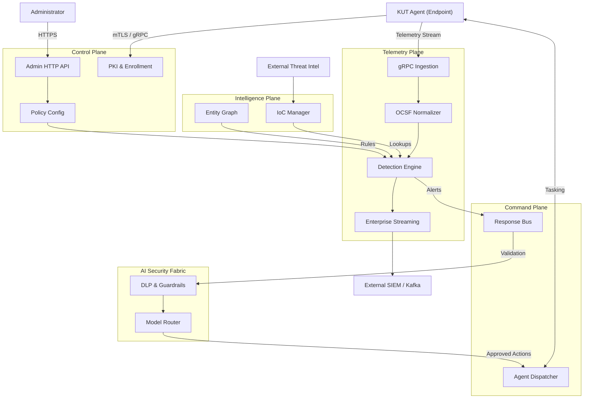

# ARCH-001: Plane Separation Architecture

## 1. Target Plane Architecture

To resolve the monolithic bottleneck in `server/internal/app/app.go`, the KUT Security Suit will be divided into specific, decoupled operational planes. 

### Control Plane (`server/internal/controlplane/`)
**Responsibilities:** System administration, PKI and mTLS lifecycle, agent enrollment, configuration management, and policy distribution.
- **Components:** Admin HTTP API, Web Console, Enrollment Service, Config Manager.
- **Boundary:** Receives requests from administrators; issues configurations to agents.

### Telemetry Plane (`server/internal/telemetryplane/`)
**Responsibilities:** High-throughput data ingestion and processing.
- **Components:** Agent gRPC streaming handler, OCSF normalizer, Detection Engine, Event Lake, Enterprise streaming hooks (Kafka, ClickHouse, S3).
- **Boundary:** Receives raw telemetry from agents; pushes alerts to the Command Plane or SIEM.

### Command Plane (`server/internal/commandplane/`)
**Responsibilities:** Active response and agent tasking.
- **Components:** Response bus, Agent Dispatcher, Command Verification, Guarded Executor.
- **Boundary:** Takes response requests from Control Plane or automated AI triggers; sends executed commands to agents.

### Intelligence Plane (`server/internal/intelplane/`)
**Responsibilities:** Contextualizing security data.
- **Components:** IoC threat intelligence feed, Entity Graph, Sequence Anomaly Model, Rule Loading.
- **Boundary:** Pulls external intelligence; provides fast lookup services to the Telemetry Plane.

### AI Security Fabric (`server/internal/aifabric/`)
**Responsibilities:** Next-generation reasoning and guardrails.
- **Components:** Model Router, DLP, AI Agent Mesh.
- **Boundary:** Evaluates proposed actions from the Command Plane and analyzes complex telemetry patterns.

## 2. Plane Boundaries and Go Interfaces

Planes will communicate strictly through well-defined Go interfaces, avoiding direct package dependencies on concrete implementations.

### Interface Contracts

```go
// Telemetry Plane Interface
package telemetryplane

import "context"

type Ingestor interface {
    ProcessEvent(ctx context.Context, rawEvent []byte) error
}

type AlertSink interface {
    PublishAlert(ctx context.Context, alert Alert) error
}
```

```go
// Command Plane Interface
package commandplane

import "context"

type TaskDispatcher interface {
    DispatchCommand(ctx context.Context, agentID string, cmd Command) (TaskID string, err error)
    CancelTask(ctx context.Context, taskID string) error
}
```

```go
// Control Plane Interface
package controlplane

import "context"

type PolicyProvider interface {
    GetAgentPolicy(ctx context.Context, agentID string) (Policy, error)
}
```

### Failure Domains
- **Telemetry Plane Failure:** If the detection engine or OCSF normalizer crashes, the gRPC ingest drops events, but the Control Plane remains up. Admins can still log in, and the Command Plane can still issue isolation commands to affected endpoints.
- **Command Plane Failure:** Automation fails, but telemetry is still ingested and recorded.

## 3. Incremental Migration Plan

The monolith (`app.go`) will be decomposed incrementally to avoid breaking current deployments.

- **Phase 1: Extract Telemetry Plane**
  - Move the agent gRPC handler, stream ingestion, OCSF normalization, and detection engine to `server/internal/telemetryplane/`.
  - Introduce `telemetryplane.New()` and initialize it inside `app.go`.
- **Phase 2: Extract Command Plane**
  - Move response bus, task verification, and agent dispatching to `server/internal/commandplane/`.
  - Wire it to the Telemetry plane via `AlertSink`.
- **Phase 3: Extract Control Plane & Intel Plane**
  - Move Admin API, web console, PKI, and IoC updates to their respective planes.
- **Phase 4: Coordinator `app.go`**
  - `app.go` becomes a lightweight dependency injection coordinator that wires interfaces together and starts plane lifecycles.

## 4. Architecture Diagram


